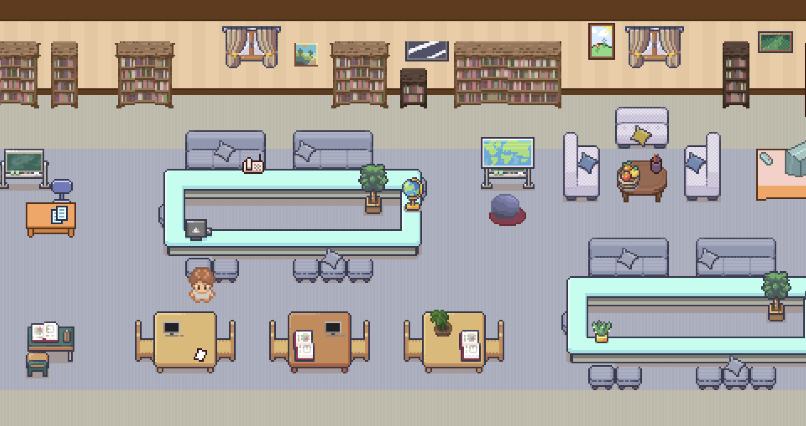
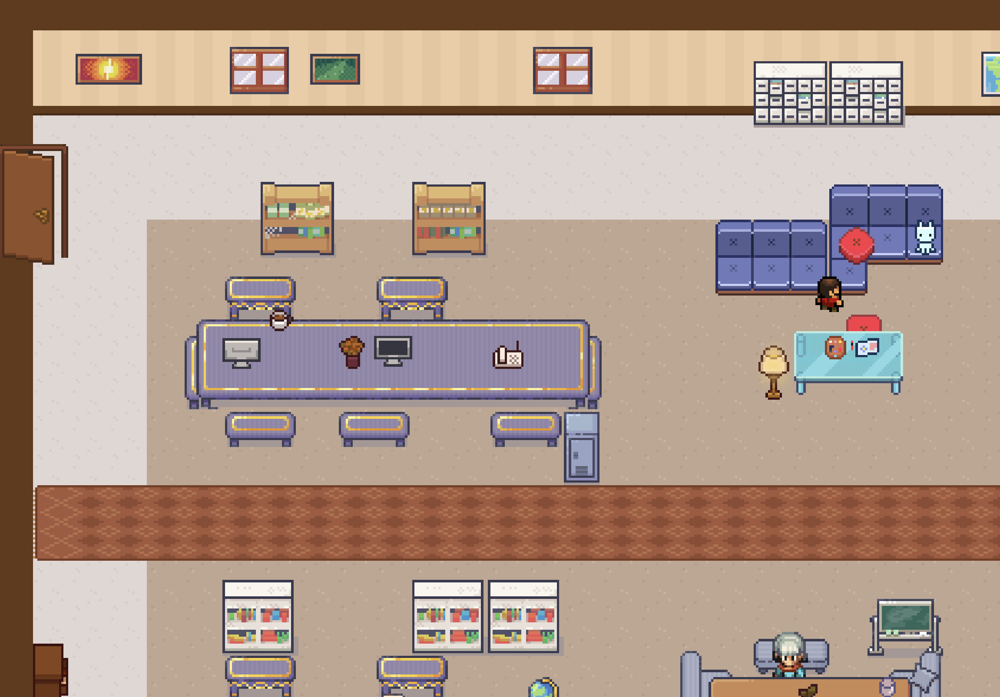
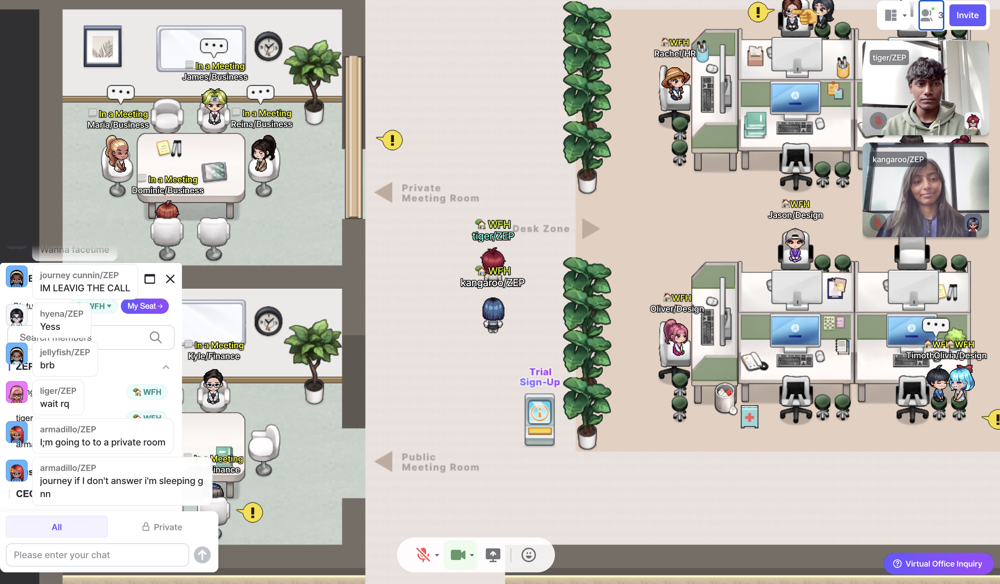

# HAVEN 🌐

**Revolutionizing Remote Work with Interactive 2D Workspaces**

  

_HAVEN's interactive 2D workspace interface_

HAVEN is a dynamic 2D virtual workspace designed to transform remote work and online education into engaging, collaborative experiences. Say goodbye to monotonous video calls and hello to a vibrant, interactive environment where productivity meets fun. Built for remote teams, educators, and students, HAVEN bridges the gap between isolation and connection.

---

## ✨ **Features**

### **Immersive Workspaces**

- **2D Metaverse Environment**: Navigate customizable virtual offices or classrooms with avatars.
- **Real-Time Communication**: Voice, video, and text chat powered by **Socket.IO** for seamless interaction.

### **All-in-One Productivity Hub**

- **Smart Calendar Integration**: Algorithms analyze team calendars to auto-schedule meetings, ensuring optimal availability.
- **Third-Party Integrations**: Sync with **Slack**, **Gmail**, and popular calendar tools (Google Calendar, Outlook).
- **Meeting Rooms**: One-click team meetings with integrated video conferencing.

### **Work-Life Balance**

- **Arcade Room**: De-stress with built-in games to recharge during breaks.
- **Customizable Breakout Zones**: Create spaces for casual chats, brainstorming, or team-building activities.

### **Security & Privacy**

- End-to-end encryption for sensitive meetings and data.
- Role-based access controls for organizations and educators.

---

## 🛠️ **Tech Stack**

<!-- Add your tools here later. Example: -->

**Frontend**  

**Backend**  

**DevOps**  

---

## 🚀 **Roadmap**

- [x] Core workspace MVP (navigation, avatars, chat)
- [ ] Integrate calendar automation and Slack/Gmail APIs
- [ ] Deploy public beta with arcade room and meeting scheduler
- [ ] Future: AI-powered task management, wellness check-ins, and expanded third-party integrations.

---

## 🤝 **Contributing**

We welcome contributors! Here’s how to help:

1. **Fork the repo** and create your branch: `git checkout -b feature/your-feature`.
2. Follow our coding standards (to be detailed in CONTRIBUTING.md).
3. Test your changes thoroughly.
4. Submit a **Pull Request** with a clear description.

**Guidelines**:

- Use descriptive commit messages.
- Document new features in the wiki.
- Report bugs via **GitHub Issues**.

---

## 📜 **License**

HAVEN is [MIT Licensed](LICENSE).

---

## 📬 **Contact**

Have questions or feedback? Reach out at **sahilhere13@gmail.com / snehasingh251104@gmail.com**

---

<!-- Add screenshots/GIFs here later -->

## 🖼️ **Screenshots**

  

  

